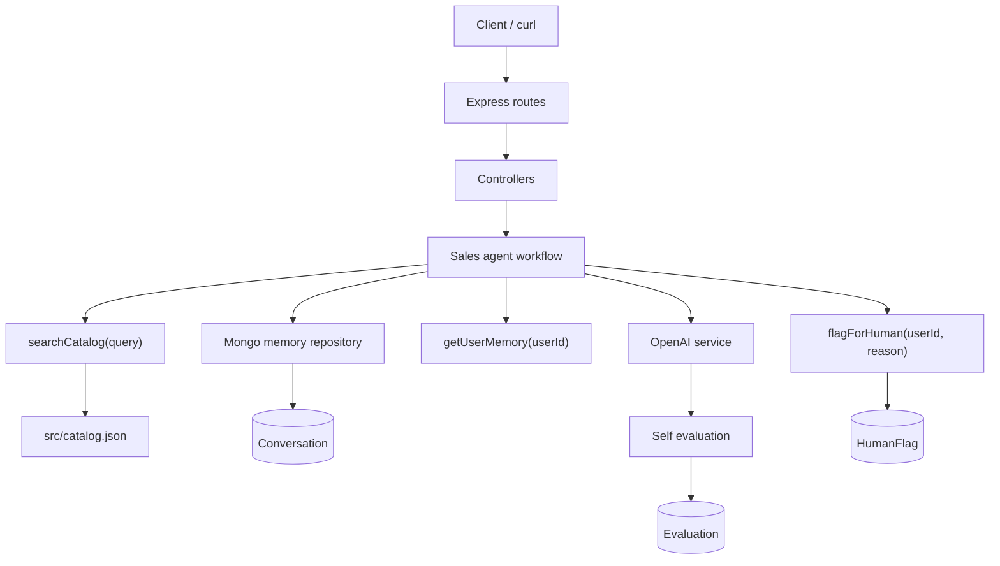

# persistent-sales-assistant-agent

A TypeScript/Express backend for a persistent sales assistant. It remembers users in MongoDB, searches a small product catalog, generates a sales response, evaluates that response, and stores the full conversation/eval trail.

Live URL: `https://your-deployed-url.vercel.app`

## Tech Stack

- Node.js
- Express.js
- TypeScript
- MongoDB + Mongoose
- OpenAI SDK
- Zod
- Vercel / Railway

## Architecture



Request flow:

```text
POST /chat/:userId
load memory -> search catalog -> generate response -> self evaluate -> save chat/eval -> return result
```

## Folder Structure

```text
src/
+-- agents/
+-- config/
+-- controllers/
+-- memory/
+-- models/
+-- routes/
+-- services/
+-- tools/
+-- utils/
+-- validators/
+-- catalog.json
+-- app.ts
+-- server.ts
```

## API Endpoints

| Method | Route | Purpose |
| --- | --- | --- |
| `GET` | `/` | Basic service info and endpoint list |
| `POST` | `/chat/:userId` | Chat with the assistant |
| `GET` | `/chat/:userId/history` | Get saved conversation history |
| `DELETE` | `/chat/:userId/memory` | Clear user history, evals, and flags |
| `GET` | `/chat/:userId/evals` | Get aggregate evaluation metrics |
| `GET` | `/catalog` | Return product catalog JSON |
| `GET` | `/health` | Check service and MongoDB status |

## Product Catalog

The catalog lives in `src/catalog.json`. It has three plans:

- Starter: `$49/mo`
- Growth: `$199/mo`
- Enterprise: `$499/mo`

The `searchCatalog(query)` tool does a simple keyword search over plan names, prices, and features. That is enough for this assignment-sized catalog and keeps the behavior easy to inspect.

## Memory Design

Memory is persisted in MongoDB using the `Conversation` model. Each saved message includes:

- `userId`
- `role`
- `message`
- `sessionId`
- timestamps from Mongoose

On every chat request, the agent loads previous messages for that user before calling the response generator. After the answer is ready, it saves both the user message and assistant response with the same `sessionId`.

The memory access is behind `src/memory/memoryRepository.ts`. There is only one implementation, `MongoMemoryRepository`, because the assignment specifically asks for MongoDB persistence. I still kept the small interface because it makes the agent code cleaner without adding much ceremony.

## Eval Design

Every chat response returns this shape:

```json
{
  "response": "...",
  "eval": {
    "groundedness": 0.91,
    "relevance": 0.88,
    "confidence": 0.85,
    "flagged": false,
    "reasoning": "..."
  },
  "tools_called": ["getUserMemory", "searchCatalog"],
  "session_id": "uuid"
}
```

When `OPENAI_API_KEY` is available, the app asks the model to return JSON for the evaluation and validates it with Zod. The eval log is saved in the `Evaluation` collection.

If the OpenAI key is missing, quota is exhausted, or the model returns invalid JSON, the app falls back to a small local evaluator. That fallback is not as smart as an LLM judge, but it keeps the API usable during demos and local review.

If `flagged` is true, the agent calls `flagForHuman(userId, reason)` and saves a `HumanFlag` record. The flag path is meant for risky sales moments like legal terms, custom discounts, refunds, or unsupported promises.

## Local Setup

```bash
npm install
cp .env.example .env
npm run dev
```

On Windows PowerShell:

```powershell
npm install
Copy-Item .env.example .env
npm run dev
```

Fill `.env` before running:

```env
PORT=8000
NODE_ENV=development
MONGODB_URI=mongodb+srv://<username>:<password>@<cluster-url>/persistent-sales-assistant-agent
OPENAI_API_KEY=<your-openai-key>
OPENAI_MODEL=gpt-4.1-mini
```

`OPENAI_API_KEY` can be empty for local testing. The app will use fallback responses/evals, but MongoDB memory still works.

## Local Curl Examples

Health:

```bash
curl http://localhost:8000/health
```

Catalog:

```bash
curl http://localhost:8000/catalog
```

First chat call:

```bash
curl -X POST http://localhost:8000/chat/demo-user \
  -H "Content-Type: application/json" \
  -d '{"message":"We have 20 users and need webhooks. Which plan fits?"}'
```

Second chat call proves memory is working:

```bash
curl -X POST http://localhost:8000/chat/demo-user \
  -H "Content-Type: application/json" \
  -d '{"message":"Does that plan also include priority support?"}'
```

History:

```bash
curl http://localhost:8000/chat/demo-user/history
```

Evaluation summary:

```bash
curl http://localhost:8000/chat/demo-user/evals
```

Clear memory:

```bash
curl -X DELETE http://localhost:8000/chat/demo-user/memory
```

## Railway Deployment

This repo is ready for Railway. `railway.json` tells Railway to start the app with:

```bash
npm run build && npm start
```

Steps:

1. Push this project to GitHub.
2. Open Railway and create a new project from the GitHub repo.
3. Add a MongoDB database service in Railway, or use MongoDB Atlas.
4. Add the environment variables listed below.
5. Deploy.
6. Open the generated Railway domain and test `/health`.

## Railway Environment Variables

Add these in Railway project settings:

```env
NODE_ENV=production
MONGODB_URI=mongodb+srv://<username>:<password>@<cluster-url>/persistent-sales-assistant-agent?retryWrites=true&w=majority
OPENAI_API_KEY=<your-openai-api-key>
OPENAI_MODEL=gpt-4.1-mini
```

Do not manually set `PORT` on Railway. Railway provides it at runtime and the app reads it automatically.

If using the long MongoDB Atlas standard connection string, keep the same database name in the path:

```env
MONGODB_URI=mongodb://<username>:<password>@host1:27017,host2:27017,host3:27017/persistent-sales-assistant-agent?ssl=true&replicaSet=<replica-set>&authSource=admin&appName=<app-name>
```

## Vercel Deployment

Vercel runs this project through `api/index.ts`, which adapts the Express app to a serverless function. Local development still uses `src/server.ts`.

Steps:

1. Push this project to GitHub.
2. Go to [https://vercel.com](https://vercel.com).
3. Click **Add New** -> **Project**.
4. Import the GitHub repo.
5. Keep the framework preset as **Other**.
6. Add the environment variables listed below.
7. Click **Deploy**.

Vercel reads `vercel.json` and routes all requests to:

```text
api/index.ts
```

## Vercel Environment Variables

Add these in Vercel project settings:

```env
NODE_ENV=production
MONGODB_URI=mongodb+srv://<username>:<password>@<cluster-url>/persistent-sales-assistant-agent?retryWrites=true&w=majority
OPENAI_API_KEY=<your-openai-api-key>
OPENAI_MODEL=gpt-4.1-mini
```

Do not add `PORT` on Vercel. Serverless functions do not listen on a port.

If your MongoDB Atlas URI uses the longer replica-set format, this is also fine:

```env
MONGODB_URI=mongodb://<username>:<password>@host1:27017,host2:27017,host3:27017/persistent-sales-assistant-agent?ssl=true&replicaSet=<replica-set>&authSource=admin&appName=<app-name>
```

## Curl Commands for Deployed API

Set your deployed URL once. This works for Vercel, Railway, or Render:

```bash
BASE_URL="https://your-deployed-url.vercel.app"
```

PowerShell:

```powershell
$env:BASE_URL="https://your-deployed-url.vercel.app"
```

Health:

```bash
curl "$BASE_URL/health"
```

Catalog:

```bash
curl "$BASE_URL/catalog"
```

First chat:

```bash
curl -X POST "$BASE_URL/chat/demo-user" \
  -H "Content-Type: application/json" \
  -d '{"message":"We are a 20 person team and need webhooks. Which plan should we choose?"}'
```

Second chat, using memory:

```bash
curl -X POST "$BASE_URL/chat/demo-user" \
  -H "Content-Type: application/json" \
  -d '{"message":"Does that same plan include priority support?"}'
```

History:

```bash
curl "$BASE_URL/chat/demo-user/history"
```

Evals:

```bash
curl "$BASE_URL/chat/demo-user/evals"
```

Clear memory:

```bash
curl -X DELETE "$BASE_URL/chat/demo-user/memory"
```

## Tradeoffs

- MongoDB is used directly through Mongoose. For this assignment, that is simpler than adding a separate repository layer for every model.
- Catalog search is keyword-based. With only three plans, semantic search would add more moving parts than value.
- The fallback response/eval path keeps demos running when OpenAI quota is missing. In a real app, I would show a clearer degraded-mode status in admin logs.
- Conversation history is returned all at once. For larger usage, this should be paginated.
- The app logs errors to the console because Vercel/Railway capture stdout and stderr. A production team would likely add structured logging and request IDs.
- Vercel serverless functions are fine for an assignment demo, but they are not the same as a long-running Node server. Cold starts can happen, and very long LLM calls may hit function limits.
- There is no frontend because the assignment only asks for the backend API.

## 2-3 Minute Demo Video Script

1. Intro, 15 seconds:
   "This is my persistent sales assistant backend built with Node.js, Express, TypeScript, MongoDB, Mongoose, OpenAI, and Zod. There is no frontend because the assignment focuses on the backend API."

2. Architecture, 25 seconds:
   "The request starts at the Express route, goes to the chat controller, then into the sales agent. The agent loads memory from MongoDB, searches the local catalog, generates a response, runs self evaluation, stores the messages and eval, and returns the final response."

3. Code walkthrough, 35 seconds:
   "The main workflow is in `src/agents/salesAgent.ts`. The real tools are in `src/tools`: `searchCatalog`, `getUserMemory`, and `flagForHuman`. MongoDB models are in `src/models`, and validation is handled with Zod in `src/validators`."

4. Live API test, 45 seconds:
   "First I call `/health` to show the service is running. Then I call `/catalog` to show the available plans. Next I send a first chat message asking about a 20 person team needing webhooks. The response includes `response`, `eval`, `tools_called`, and `session_id`."

5. Memory proof, 25 seconds:
   "Now I send a second message asking whether that same plan includes priority support. Since the user ID is the same, the agent loads the previous conversation from MongoDB before answering. I can also call `/history` to show both turns were saved."

6. Evals and cleanup, 20 seconds:
   "Finally I call `/evals` to show aggregate quality metrics, then `/memory` with DELETE to clear the user's history, eval logs, and flags."

7. Closing, 10 seconds:
   "The project is ready for Vercel using `vercel.json`, and it also keeps a Railway config. Environment variables are documented in the README, and fallback behavior keeps the demo working if OpenAI is unavailable."
