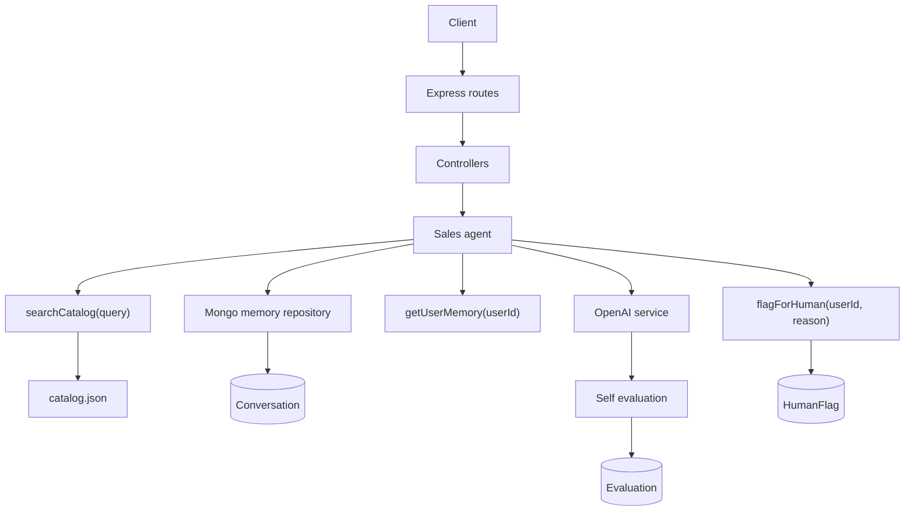

# persistent-sales-assistant-agent

Backend API for a persistent sales assistant. The service stores conversation memory in MongoDB, searches a small product catalog, generates sales responses with OpenAI, evaluates each response, and records escalation flags when a human should step in.

Live API: `https://persistent-sales-assistant-agent-six.vercel.app`

Latest deployment: `https://persistent-sales-assistant-agent-1sjtxapax.vercel.app`

## Stack

- Node.js
- Express.js
- TypeScript
- MongoDB + Mongoose
- OpenAI SDK
- Zod
- Vercel

## Architecture



## API

| Method | Route | Description |
| --- | --- | --- |
| `GET` | `/` | Service metadata |
| `GET` | `/health` | Health and database status |
| `GET` | `/catalog` | Product catalog |
| `POST` | `/chat/:userId` | Chat with the sales assistant |
| `GET` | `/chat/:userId/history` | Full user conversation history |
| `GET` | `/chat/:userId/evals` | Aggregated evaluation metrics |
| `DELETE` | `/chat/:userId/memory` | Clear user history, evals, and flags |

## Memory Design

Memory is stored in MongoDB through the `Conversation` model. Each message stores `userId`, `role`, `message`, `sessionId`, and timestamps.

The agent loads previous messages for the same `userId` before generating a response. After the response is ready, both the user message and assistant message are saved with the same session id.

The memory access is wrapped by `MemoryRepository`, with MongoDB as the current implementation.

## Eval Design

Every chat response includes:

```json
{
  "response": "...",
  "eval": {
    "groundedness": 0.91,
    "relevance": 0.88,
    "confidence": 0.85,
    "flagged": false,
    "reasoning": "..."
  },
  "tools_called": ["getUserMemory", "searchCatalog"],
  "session_id": "uuid"
}
```

OpenAI generates the response and evaluation when `OPENAI_API_KEY` is available. The evaluation JSON is validated with Zod before being saved.

If OpenAI is unavailable or quota is exhausted, the API uses a local fallback so the service still works for review.

## Environment Variables

```env
NODE_ENV=production
MONGODB_URI=mongodb+srv://<username>:<password>@<cluster-url>/persistent-sales-assistant-agent
OPENAI_API_KEY=<openai-api-key>
OPENAI_MODEL=gpt-4.1-mini
```

`PORT` is only used for local development. Vercel provides runtime handling for deployed functions.

## Local Commands

```bash
npm install
npm run dev
```

## Deployment

The deployed version runs on Vercel through `api/index.ts`. `vercel.json` rewrites all requests to the Express app.

The project also builds as a normal Node service:

```bash
npm run build
npm start
```

## Curl Checks

```bash
BASE_URL="https://persistent-sales-assistant-agent-six.vercel.app"

curl "$BASE_URL/health"
curl "$BASE_URL/catalog"

curl -X POST "$BASE_URL/chat/demo-user" \
  -H "Content-Type: application/json" \
  -d '{"message":"We have 20 users and need webhooks. Which plan fits?"}'

curl -X POST "$BASE_URL/chat/demo-user" \
  -H "Content-Type: application/json" \
  -d '{"message":"Does that plan include priority support?"}'

curl "$BASE_URL/chat/demo-user/history"
curl "$BASE_URL/chat/demo-user/evals"
curl -X DELETE "$BASE_URL/chat/demo-user/memory"
```

## Tradeoffs

- Catalog search is keyword-based because the catalog is small and predictable.
- MongoDB is used directly through Mongoose to keep the service simple.
- Conversation history is not paginated yet.
- OpenAI fallback behavior is included so demos do not fail when quota is unavailable.
- Vercel serverless deployment can have cold starts, but it is fine for this assignment-sized API.
